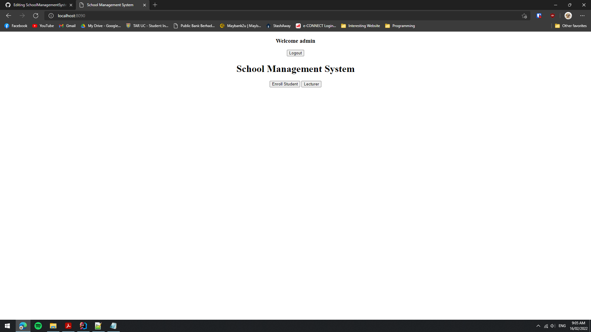
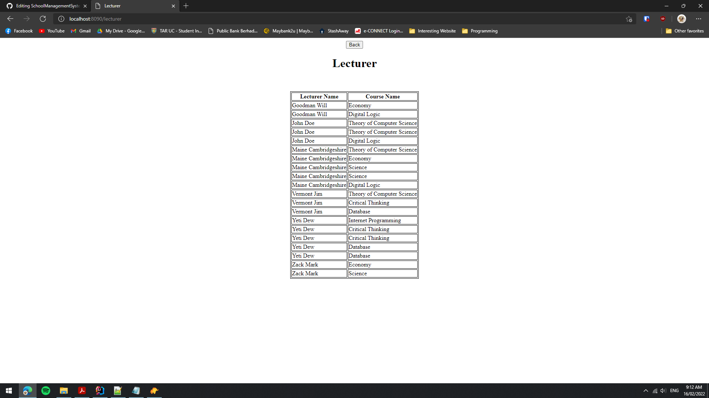

# SchoolManagementSystem
ModeFair Technical Test

Login Crediential
Account Username: admin
Account password: modefair

Instructions:
1. run resources/script/schema.sql
2. run resources/script/data.sql
3. run application

Screenshot of System:
1. Login page

2. Index page after User login

3. Available schedule page after user click Schedule button

4. Enroll page after user click Enroll button. User allows add a student into the available schedule

5. After click save, user able to view student list at that schedule

6. Lecturer page if user click Lecturer button on index page

